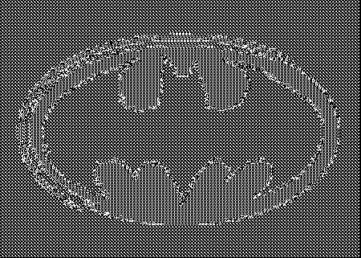
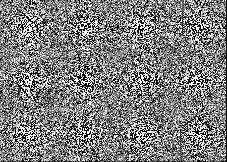

# Kryptografia2020
## Zadanie 3 - Tryby szyfrów blokowych
Treść zadania znajduje się w pliku PDF 'Tryby szyfrów blokowych', który znajduje się w katalogu 'Treść zadania'.

## Wizualizacja szyfrowania obrazka:
 
Obrazek na wejściu

Obrazek zaszyfrowany przy użyciu ECB

Obrazek zaszyfrowany przy użyciu CBC
